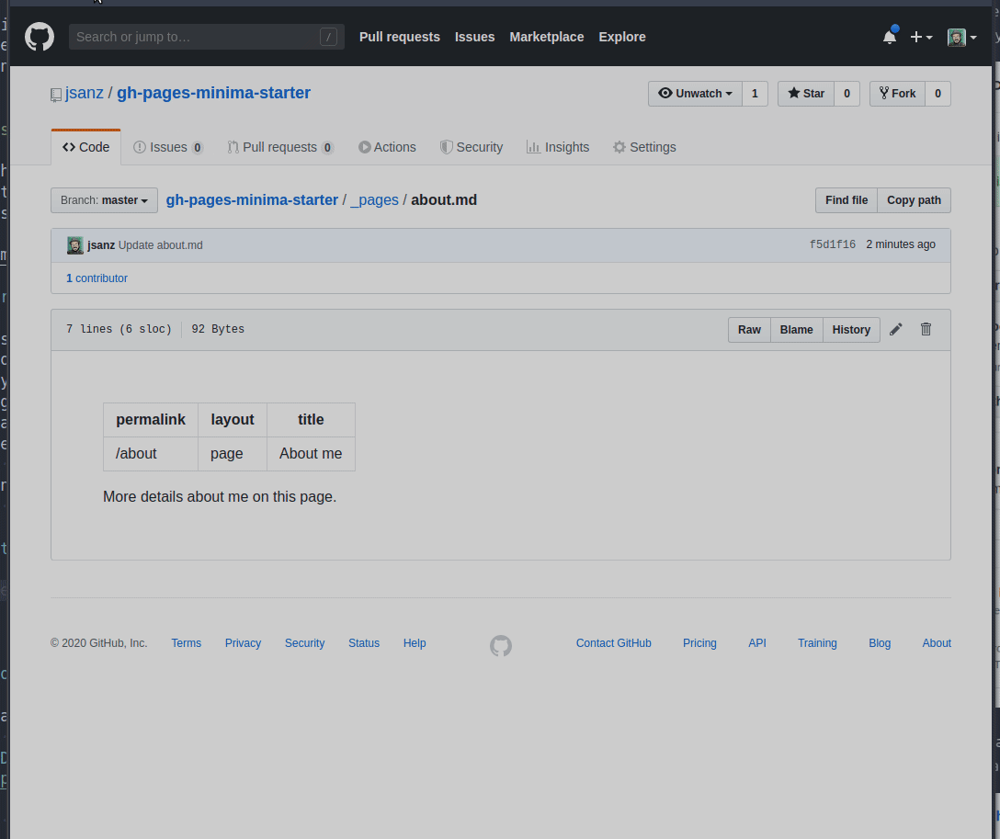
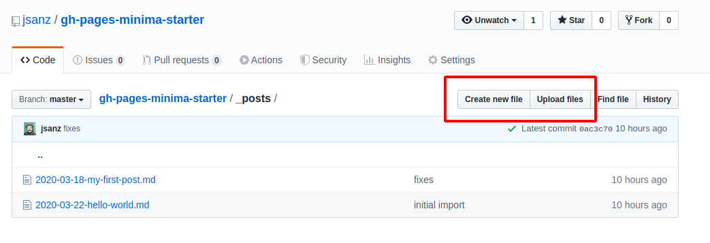

# gh-pages-minima-starter

This is a template and some instructions for running Github Pages with the [`minima` theme][minima]. This repo has what I consider the minimum pieces for a personal blog using [Jekyll][jk] and [Github Pages][gh-site]:

* Frontpage that includes your last blog posts: `_pages/frontpage.md`
* Archive for all your posts: `_pages/archive.md`
* About page: `_pages/about.md`
* Minimum 404 page: `_pages/404.md`
* Minimum metadata in the `_config.yml`
* Example CSS change inside `assets/main.scss`
* Custom footer template `_includes/footer.html`

Check out the excellent [`minima` theme][minima] documentation for further details and customization and the [official docs][gh] for more details on how Github Pages work.

Do you have questions? feel free to [open an issue](https://github.com/jsanz/gh-pages-minima-starter/issues/new/choose) or reach me from my [contact form](https://www.jorgesanz.net/contact/).

## Fork it!!

How to use this template? Well the easiest way may be forking this repository into your own account. You can have your website **without setting up a local environment** (but you can do it if you are a bit tech savvy). After forking the project, the first thing I would do is to change the project name at the `Settings` tab. The name of the project will became part of the website main address. So if for example you name your repo as `myblog`, your website will be available at `https://yourusername.github.io/myblog`. There is a special case, if you name your repo as `yourusername.github.io` then the website will be published at `https://yourusername.github.io` which may be a good idea for a personal website!

Next thing to do is to customize the main settings on the `_config.yml` file: website title, description, and your details. If you don't want to show excerpts of your posts in the front page you can disable that checking removing that entry on adding a `#` at the beginning of that line. You don't need to change anything else.

After the configuration is ready you can enable the website publishing on the same `Settings` page a bit further down. Remember to set up the `master` branch as the source of your documents. Once you save your settings wait for a few minutes and your site is ready!!

Any time you change anything in your repo you do an operation called _pushing a commit_. On every push the website is rebuilt. You can see the details of that process in the `Environment` section that is accessible from the repository frontpage.

## Editing your content

Your website is published with your details but now how to edit the frontpage, remove the example blog posts or create your own. Let's dive in to that. First thing to know is that Github Pages by default accepts rendering content in HTML and [Markdown][md]. I strongly recommend using Markdown because it's very simple and out of your way when you write, since the formatting rules are very shttps://pages.github.com/imple. If you are going to write a long piece, you may want to use an external editor and then upload or paste your content into github. There are many text editors that support Markdown but if I have to suggest one that works well for writing I'd go for [typora][typora] because it's supporting Linux, Windows, and also MacOS (in beta).

### How to edit a page in Github

Editing pages is super simple, just click on the pencil in the top right corner and open an editing interface where you can even preview the changes that you are applying. Once you are done add a short comment to your change (_commit_ in git/github vocabulary) and save them. Remember all changes are saved and available for you to explore afterwards if needed.

### Posts

Posts in your website are stored in the `_posts` folder and they follow a naming convention that you should follow using the date first (year, month, day) and then a simple title. This helps to keep things organized. You can use the top right buttons to create new files or upload them.

Find more details on how to write Jekyll posts on [the docs][jk-posts].

## Local environment

I've included a simple `docker-compose.yml` file so you can spin up a local environment without having to install in your computer Ruby or any other library. Just install [Docker][docker] and [Docker Compose][compose], visit the repo folder and run `docker-compose up` and visit `http://localhost:8080`. 

Alternatively, if you prefer to install all the software locally please follow the [docs][install].

[gh-site]: https://pages.github.com/
[jk]: https://jekyllrb.com/
[minima]: https://github.com/jekyll/minima/tree/2.5-stable
[gh]: https://help.github.com/en/github/working-with-github-pages
[install]: https://help.github.com/en/github/working-with-github-pages/testing-your-github-pages-site-locally-with-jekyll
[docker]: https://docs.docker.com/get-docker/
[compose]: https://docs.docker.com/compose/install/
[gh-settings]: https://help.github.com/en/github/working-with-github-pages/configuring-a-publishing-source-for-your-github-pages-site
[md]: https://daringfireball.net/projects/markdown/syntax
[typora]: https://typora.io/
[jk-posts]: https://jekyllrb.com/docs/posts/